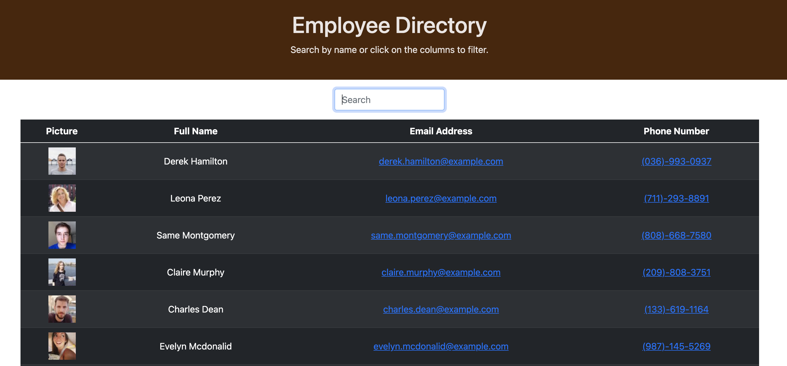

# Employee-Directory

This is an employee directory built with React. The application's UI contains components, component state, and responds to user events.

The user can look up employee information by inputing the name in the search box or by clicking on the cloumns.

# Technologies used:

- React
- Node JS
- HTML
- CSS
- Bootstrap

# Deployed links:

https://rayaalsaedi.github.io/Employee-Directory/

https://github.com/rayaalsaedi/Employee-Directory

# Preview of the application:

